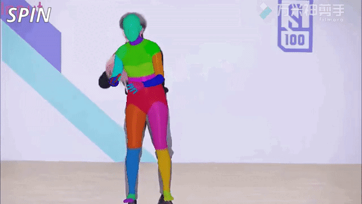
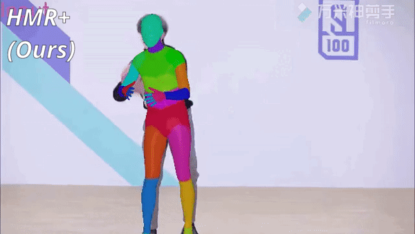

<div align="center">

# Benchmarking 3D Pose and Shape Estimation Beyond Algorithms


### [Installation](#installation) | [Train](#train) | [Evaluation](#evaluation) | [Augmentation](#augmentation) | [FLOPs](#flops) | [Backbones](#backbones)

</div>

## Introduction

This repository builds upon [MMHuman3D](https://openmmlab.com/mmhuman3d), an open source PyTorch-based codebase for the use of 3D human parametric models in computer vision and computer graphics. MMHuman3D is a part of the [OpenMMLab](https://openmmlab.com/) project.

These features will be contributed to MMHuman3D at a later date.

The main branch works with **PyTorch 1.7+**.
<!--
https://user-images.githubusercontent.com/62529255/144362861-e794b404-c48f-4ebe-b4de-b91c3fbbaa3b.mp4 -->


HMR+ uses the same ResNet-50 backbone and training datasets as HMR and SPIN (without fittings). We find that adopting our training tricks is sufficient to build a model that is comparable to the previous SOTA algorithms without using bigger model capacity or newer datasets. We also include HMR* uses Twins-SVT backbone and datasets following PARE.  See our [paper]() for more details.
<p>
    
    
    
    
</p>

### Major Features added onto MMHuman3D


- **Provide annotation files**

  Will add links to Gdrive. Future works can use these files to train on any of the 31 dataset.

- **Provide config files for 31 single and multi-dataset benchmarks**

  Future works can use these configs for training and obtain benchmarks on HMR for baseline comparison on their selected dataset mixes and partition.

- **Evaluation for different benchmarks**

  Easily obtain benchmarks on their trained model on five test sets (1) 3DPW-test (2) H36M (P1/ P2) test (3) EFT-OCHuman-test (4)  EFT-COCO-Val (5) EFT-LSPET-test

- **Add 9 augmentation techniques**

  Train with a suite of augmentation techniques for a more robust model

- **FLOPs and Param evaluation for trained model**

  Evaluate flops and params for trained model

- **Provide training log and model pths for inference**

  Will add links to Gdrive


Supported datasets:

<details open>
<summary>(click to collapse)</summary>

- [x] [3DPW](https://virtualhumans.mpi-inf.mpg.de/3DPW/) (ECCV'2018)
- [x] [AGORA](https://agora.is.tue.mpg.de/) (CVPR'2021)
- [x] [AMASS](https://amass.is.tue.mpg.de/) (ICCV'2019)
- [x] [COCO](https://cocodataset.org/#home) (ECCV'2014)
- [x] [COCO-WholeBody](https://github.com/jin-s13/COCO-WholeBody) (ECCV'2020)
- [x] [CrowdPose](https://github.com/Jeff-sjtu/CrowdPose) (CVPR'2019)
- [x] [EFT](https://github.com/facebookresearch/eft) (3DV'2021)
- [x] [Human3.6M](http://vision.imar.ro/human3.6m/description.php) (TPAMI'2014)
- [x] [InstaVariety](https://github.com/akanazawa/human_dynamics/blob/master/doc/insta_variety.md) (CVPR'2019)
- [x] [LSP](https://sam.johnson.io/research/lsp.html) (BMVC'2010)
- [x] [LSP-Extended](https://sam.johnson.io/research/lspet.html) (CVPR'2011)
- [x] [MPI-INF-3DHP](http://gvv.mpi-inf.mpg.de/3dhp-dataset/) (3DC'2017)
- [x] [MPII](http://human-pose.mpi-inf.mpg.de/) (CVPR'2014)
- [x] [Penn Action](http://dreamdragon.github.io/PennAction/) (ICCV'2012)
- [x] [PoseTrack18](https://posetrack.net/users/download.php) (CVPR'2018)
- [x] [SURREAL](https://www.di.ens.fr/willow/research/surreal/data/) (CVPR'2017)
- [x] [UP3D](https://files.is.tuebingen.mpg.de/classner/up/) (CVPR'2017)


Supported backbones:

<details open>
<summary>(click to collapse)</summary>

- [x] ResNet (CVPR'2016)
- [x] ResNeXt (CVPR'2017)
- [x] HRNet (CVPR'2019)
- [x] EfficientNet
- [x] ViT
- [x] Swin
- [x] Twins

## Installation

General set-up instructions follow that of [MMHuman3d](https://openmmlab.com/mmhuman3d). Please refer to [install.md](./install.md) for installation.

## Data Preparation

Please refer to [data_preparation.md](./preprocess_dataset.md) for data preparation.

## Body Model Preparation

- [SMPL](https://smpl.is.tue.mpg.de/) v1.0 is used in our experiments.
  - Neutral model can be downloaded from [SMPLify](https://smplify.is.tue.mpg.de/).
  - All body models have to be renamed in `SMPL_{GENDER}.pkl` format. <br/>
    For example, `mv basicModel_neutral_lbs_10_207_0_v1.0.0.pkl SMPL_NEUTRAL.pkl`
- [J_regressor_extra.npy](https://openmmlab-share.oss-cn-hangzhou.aliyuncs.com/mmhuman3d/models/J_regressor_extra.npy?versionId=CAEQHhiBgIDD6c3V6xciIGIwZDEzYWI5NTBlOTRkODU4OTE1M2Y4YTI0NTVlZGM1)
- [J_regressor_h36m.npy](https://openmmlab-share.oss-cn-hangzhou.aliyuncs.com/mmhuman3d/models/J_regressor_h36m.npy?versionId=CAEQHhiBgIDE6c3V6xciIDdjYzE3MzQ4MmU4MzQyNmRiZDA5YTg2YTI5YWFkNjRi)
- [smpl_mean_params.npz](https://openmmlab-share.oss-cn-hangzhou.aliyuncs.com/mmhuman3d/models/smpl_mean_params.npz?versionId=CAEQHhiBgICN6M3V6xciIDU1MzUzNjZjZGNiOTQ3OWJiZTJmNThiZmY4NmMxMTM4)

Download the above resources and arrange them in the following file structure:

```text
mmhuman3d
├── mmhuman3d
├── docs
├── tests
├── tools
├── configs
└── data
    └── body_models
        ├── J_regressor_extra.npy
        ├── J_regressor_h36m.npy
        ├── smpl_mean_params.npz
        └── smpl
            ├── SMPL_FEMALE.pkl
            ├── SMPL_MALE.pkl
            └── SMPL_NEUTRAL.pkl
```

## Train

### Training with a single / multiple GPUs

```shell
python tools/train.py ${CONFIG_FILE} ${WORK_DIR} --no-validate
```
Example: using 1 GPU to train HMR.
```shell
python tools/train.py ${CONFIG_FILE} ${WORK_DIR} --gpus 1 --no-validate
```

### Training with Slurm

If you can run MMHuman3D on a cluster managed with [slurm](https://slurm.schedmd.com/), you can use the script `slurm_train.sh`.

```shell
./tools/slurm_train.sh ${PARTITION} ${JOB_NAME} ${CONFIG_FILE} ${WORK_DIR} ${GPU_NUM} --no-validate
```

Common optional arguments include:
- `--resume-from ${CHECKPOINT_FILE}`: Resume from a previous checkpoint file.
- `--no-validate`: Whether not to evaluate the checkpoint during training.

Example: using 8 GPUs to train HMR on a slurm cluster.
```shell
./tools/slurm_train.sh my_partition my_job configs/hmr/resnet50_hmr_pw3d.py work_dirs/hmr 8 --no-validate
```

You can check [slurm_train.sh](https://github.com/open-mmlab/mmhuman3d/tree/main/tools/slurm_train.sh) for full arguments and environment variables.


## Evaluation

There's five benchmarks for evaluation:
- 3DPW-test (P2)
- H36m-test (P2)
- EFT-COCO-val
- EFT-LSPET-test
- EFT-OCHuman-test

### Evaluate with a single GPU / multiple GPUs

```shell
python tools/test.py ${CONFIG} --work-dir=${WORK_DIR} ${CHECKPOINT} --metrics=${METRICS}
```
Example:
```shell
python tools/test.py configs/hmr/resnet50_hmr_pw3d.py --work-dir=work_dirs/hmr work_dirs/hmr/latest.pth --metrics pa-mpjpe mpjpe
```

### Evaluate with slurm

If you can run MMHuman3D on a cluster managed with [slurm](https://slurm.schedmd.com/), you can use the script `slurm_test.sh`.

```shell
./tools/slurm_test.sh ${PARTITION} ${JOB_NAME} ${CONFIG} ${WORK_DIR} ${CHECKPOINT} --metrics ${METRICS}
```
Example:
```shell
./tools/slurm_test.sh my_partition test_hmr configs/hmr/resnet50_hmr_pw3d.py work_dirs/hmr work_dirs/hmr/latest.pth 8 --metrics pa-mpjpe mpjpe
```


## FLOPs Calculation

`tools/get_flops.py` is a script adapted from [flops-counter.pytorch](https://github.com/sovrasov/flops-counter.pytorch) and [MMDetection](https://github.com/open-mmlab/mmdetection) to compute the FLOPs and params of a given model.

```shell
python tools/get_flops.py ${CONFIG_FILE} [--shape ${INPUT_SHAPE}]
```

You will get the results like this.

```text
==============================
Input shape: (3, 1280, 800)
Flops: 239.32 GFLOPs
Params: 37.74 M
==============================
```

**Note**: This tool is still experimental and we do not guarantee that the
 number is absolutely correct. You may well use the result for simple
  comparisons, but double check it before you adopt it in technical reports or papers.

1. FLOPs are related to the input shape while parameters are not. The default
 input shape is (1, 3, 224, 224).
2. Some operators are not counted into FLOPs like GN and custom operators. Refer to [`mmcv.cnn.get_model_complexity_info()`](https://github.com/open-mmlab/mmcv/blob/master/mmcv/cnn/utils/flops_counter.py) for details.
